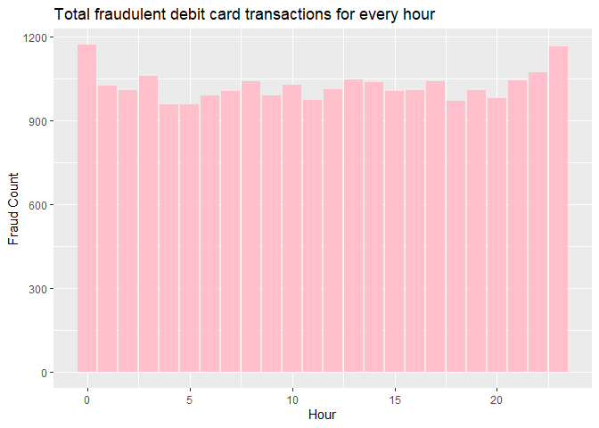
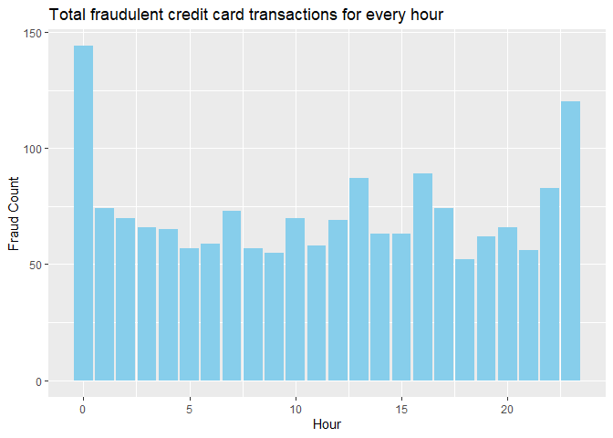
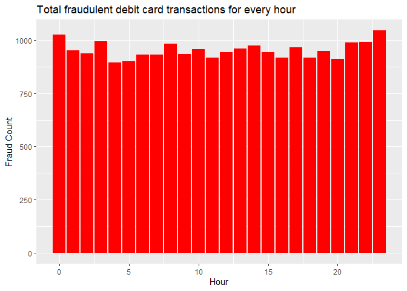
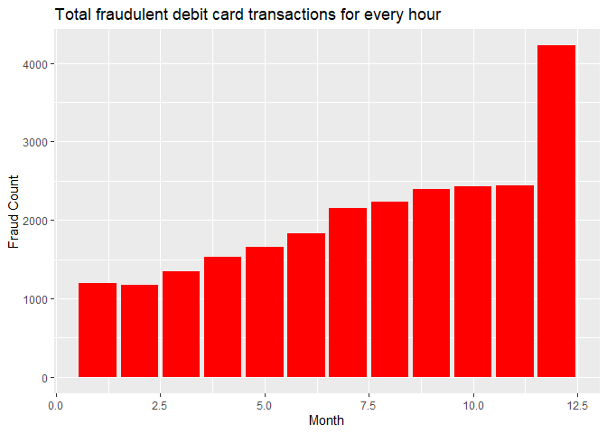
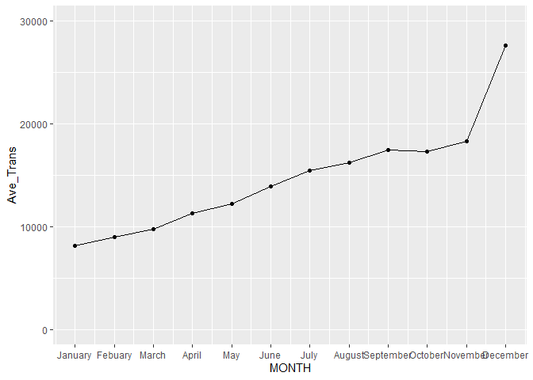
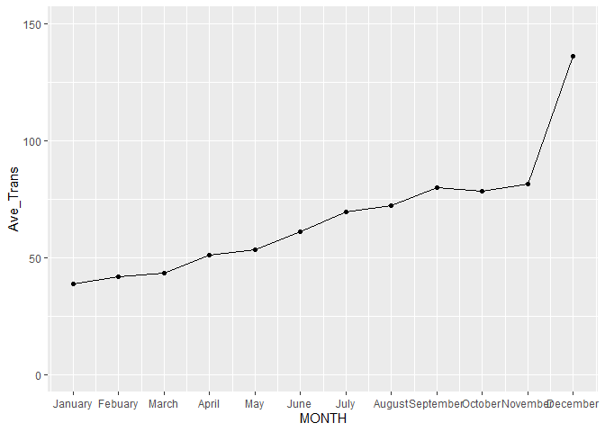

Data on Bank Fraud
================
Author: Zeddrex Navarra

Identify the count of amounts considered as fraud (should be a lot of
1500)

Identify the time of day where fraud is most common

``` r
library(readxl)
library(readr)
library(lubridate)
library(dplyr)
library(tidyverse)
```

# Combining Data

``` r
# Step 1: Get a list of all CSV files in the directory
file_list <- list.files("C:/Users/Zeddrex Navarra/Desktop/UP/2nd year second sem/Stat 125/MP1/Fraud Data", pattern = "\\.csv$", full.names = TRUE)

# Step 2: Read each CSV file and combine them using rbind
combined_data <- do.call(rbind, lapply(file_list, read.csv))

# View the combined data
head(combined_data)
```

    ##              TimeStamp CardType  Amount Fraud
    ## 1 2021-01-01T00:00:01Z       Cr 1182.34     0
    ## 2 2021-01-01T00:00:03Z       Cr 2446.80     0
    ## 3 2021-01-01T00:00:03Z       Cr  724.40     0
    ## 4 2021-01-01T00:00:05Z       Dr 1500.00     1
    ## 5 2021-01-01T00:00:13Z       Dr  594.94     0
    ## 6 2021-01-01T00:00:25Z       Cr 3641.80     0

# Extracting time data to separate columns

``` r
data_time <- combined_data %>%
  mutate(
    datetime_parsed = ymd_hms(TimeStamp), # Parse the datetime string
    month = month(datetime_parsed),             # Extract month
    day = day(datetime_parsed),                 # Extract day
    hour = hour(datetime_parsed),               # Extract hour
  ) %>%
  select(-datetime_parsed)                      # Remove the parsed datetime column

# Print the resulting dataframe
head(data_time)
```

    ##              TimeStamp CardType  Amount Fraud month day hour
    ## 1 2021-01-01T00:00:01Z       Cr 1182.34     0     1   1    0
    ## 2 2021-01-01T00:00:03Z       Cr 2446.80     0     1   1    0
    ## 3 2021-01-01T00:00:03Z       Cr  724.40     0     1   1    0
    ## 4 2021-01-01T00:00:05Z       Dr 1500.00     1     1   1    0
    ## 5 2021-01-01T00:00:13Z       Dr  594.94     0     1   1    0
    ## 6 2021-01-01T00:00:25Z       Cr 3641.80     0     1   1    0

# Analyze time of day fraud happens

``` r
fraudulent_data_time <- data_time %>%
  filter(Fraud == 1) %>% 
  select(month, hour, Fraud) %>% 
  group_by(hour) %>%
  summarize(fraud_count = n())

print(fraudulent_data_time)
```

    ## # A tibble: 24 × 2
    ##     hour fraud_count
    ##    <int>       <int>
    ##  1     0        1171
    ##  2     1        1025
    ##  3     2        1008
    ##  4     3        1060
    ##  5     4         959
    ##  6     5         959
    ##  7     6         990
    ##  8     7        1006
    ##  9     8        1041
    ## 10     9         989
    ## # … with 14 more rows

``` r
fraudulent_data_time %>% 
  arrange(desc(fraud_count)) %>%
  slice_head(n = 5)
```

    ## # A tibble: 5 × 2
    ##    hour fraud_count
    ##   <int>       <int>
    ## 1     0        1171
    ## 2    23        1165
    ## 3    22        1074
    ## 4     3        1060
    ## 5    13        1048

``` r
ggplot(fraudulent_data_time, aes(x = hour, y = fraud_count)) +
  geom_bar(stat = "identity", fill = "pink") +
  labs(x = "Hour", y = "Fraud Count") +
  ggtitle("Total fraudulent debit card transactions for every hour")
```

<!-- -->

Most fraudulent activities occur during the middle of the night,
especially in the 23rd and 0th hour

# Is there a difference in the time of day when fraudulent transactions occur between debit and credit cards?

``` r
credit_fraudulent_data_time <- data_time %>%
  filter(Fraud == 1, CardType == "Cr") %>% 
  select(month, hour, Fraud, CardType) %>% 
  group_by(hour) %>%
  summarize(fraud_count = n())

print(credit_fraudulent_data_time)
```

    ## # A tibble: 24 × 2
    ##     hour fraud_count
    ##    <int>       <int>
    ##  1     0         144
    ##  2     1          74
    ##  3     2          70
    ##  4     3          66
    ##  5     4          65
    ##  6     5          57
    ##  7     6          59
    ##  8     7          73
    ##  9     8          57
    ## 10     9          55
    ## # … with 14 more rows

``` r
credit_fraudulent_data_time %>% 
  arrange(desc(fraud_count)) %>% 
  slice_head(n=5)
```

    ## # A tibble: 5 × 2
    ##    hour fraud_count
    ##   <int>       <int>
    ## 1     0         144
    ## 2    23         120
    ## 3    16          89
    ## 4    13          87
    ## 5    22          83

``` r
credit_fraudulent_data_time %>% 
  summarize(average_fraud_count = mean(fraud_count))
```

    ## # A tibble: 1 × 1
    ##   average_fraud_count
    ##                 <dbl>
    ## 1                72.2

``` r
ggplot(credit_fraudulent_data_time, aes(x = hour, y = fraud_count)) +
  geom_bar(stat = "identity", fill = "skyblue") +
  labs(x = "Hour", y = "Fraud Count") +
  ggtitle("Total fraudulent credit card transactions for every hour")
```

<!-- -->

``` r
debit_fraudulent_data_time <- data_time %>%
  filter(Fraud == 1, CardType == "Dr") %>% 
  select(month, hour, Fraud, CardType) %>% 
  group_by(hour) %>%
  summarize(fraud_count = n())

ggplot(debit_fraudulent_data_time, aes(x = hour, y = fraud_count)) +
  geom_bar(stat = "identity", fill = "red") +
  labs(x = "Hour", y = "Fraud Count") +
  ggtitle("Total fraudulent debit card transactions for every hour")
```

<!-- -->

There is an apparent frequency of credit card fraud during the 23rd and
0th hour of the day while debit card fraud appears to be more uniformly
distributed but shows a similar increase in fraudulent transactions at
the 23rd and 0th hour.

``` r
fraudulent_month <- data_time %>%
  filter(Fraud == 1) %>% 
  select(month, Fraud) %>% 
  group_by(month) %>%
  summarize(fraud_count = n())

ggplot(fraudulent_month, aes(x = month, y = fraud_count)) +
  geom_bar(stat = "identity", fill = "red") +
  labs(x = "Month", y = "Fraud Count") +
  ggtitle("Total fraudulent debit card transactions for every hour")
```

<!-- -->

Identify whether fraud activity forms clumps

Differentiate fraud activity between debit and credit

# Data Transformation

Converting CardType and Fraud fields as factor vectors. Recoding the
values of Fraud: 1 → Y, 0 → N.

``` r
combined_fraud_data = combined_data

head(combined_fraud_data %>% mutate(
       TimeStamp = ymd_hms(TimeStamp, tz = "UTC"),
       CardType = as.factor(CardType),
       Fraud = as.factor(Fraud),
       Fraud = ifelse(Fraud == 0, "N", "Y"),
       ))
```

    ##             TimeStamp CardType  Amount Fraud
    ## 1 2021-01-01 00:00:01       Cr 1182.34     N
    ## 2 2021-01-01 00:00:03       Cr 2446.80     N
    ## 3 2021-01-01 00:00:03       Cr  724.40     N
    ## 4 2021-01-01 00:00:05       Dr 1500.00     Y
    ## 5 2021-01-01 00:00:13       Dr  594.94     N
    ## 6 2021-01-01 00:00:25       Cr 3641.80     N

# Data Summary

# Total amount lost due to fraud

``` r
combined_fraud_data %>% 
      filter(Fraud == 1) %>%
      summarize("Amount_Lost" = sum(Amount))
```

    ##   Amount_Lost
    ## 1    38058485

The bank lost 38,058,485 through fraudulent transactions in 2021.

# Vulnerability to fraud of each card type

``` r
totaldebit <- combined_fraud_data %>%
              filter(CardType == "Dr") %>%
              summarize("No. of Debit Cards" = sum(CardType == "Dr"))
totaldebitfraud <- combined_fraud_data %>%
                   filter(CardType == "Dr" & Fraud == 1) %>%
                   summarize("No. of Debit Cards" = sum(CardType == "Dr"))
noquote(paste0(totaldebitfraud/totaldebit * 100, "%"))
```

    ## [1] 0.606608516333798%

``` r
totalcredit <- combined_fraud_data %>%
               filter(CardType == "Cr") %>%
               summarize("No. of Credit Cards" = sum(CardType == "Cr"))
totalcreditfraud <- combined_fraud_data %>%
                    filter(CardType == "Cr" & Fraud == 1) %>%
                    summarize("No. of Credit Cards" = sum(CardType == "Cr"))
noquote(paste0(totalcreditfraud/totalcredit * 100, "%"))
```

    ## [1] 0.107113591737658%

0.6066% of debit card transactions in 2021 are fraudulent

0.1071% of credit card transactions in 2021 are fraudulent

Therefore, credit cards are less prone to fraud.

# Top 3 days with the greatest number of fraudulent transactions

Find the top 3 days with the greatest number of fraudulent transactions.
These are the days that fraudsters think that the card holders will be
the most vulnerable.

``` r
combined_fraud_data %>%  
  mutate(TimeStamp = as.Date(TimeStamp, "%Y-%m-%d")) %>% 
  group_by(TimeStamp) %>%
  summarize(fraud_count = sum(Fraud == 1)) %>% 
  arrange(desc(fraud_count)) %>%
  slice_head(n = 3)
```

    ## # A tibble: 3 × 2
    ##   TimeStamp  fraud_count
    ##   <date>           <int>
    ## 1 2021-12-31         230
    ## 2 2021-12-24         227
    ## 3 2021-12-25         213

The top three days with the most number of fraud transactions in order
are December 31, 24, and 25.

# Data Visualization

Plotting the average daily transactions per month.

``` r
combined_fraud_data %>% 
  mutate(TimeStamp = as.Date(TimeStamp, "%Y-%m-%d")) %>% 
  mutate("Day" = day(TimeStamp), "Month" = month(TimeStamp)) %>% 
  group_by(Day,Month) %>% 
  summarize("Trans_Count" = sum(Fraud == 0, Fraud == 1)) %>%
  group_by(Month) %>%
  summarize("Ave_Trans" = mean(Trans_Count)) %>%
  ggplot(aes(x = Month, y = Ave_Trans)) +
  geom_line()+
  geom_point()+
  scale_x_continuous(name = "MONTH",
                     breaks = c(1,2,3,4,5,6,7,8,9,10,11,12),
                     labels = c("January","Febuary","March","April","May","June"      ,"July","August","September","October","November","December")
)+
  scale_y_continuous(name = "AVERAGE MONTHLY TRANSACTIONS")+
  ylim(0, 30000)
```

    ## `summarise()` has grouped output by 'Day'. You can override using the `.groups`
    ## argument.
    ## Scale for y is already present. Adding another scale for y, which will replace
    ## the existing scale.

<!-- -->

``` r
combined_fraud_data %>% 
  mutate(TimeStamp = as.Date(TimeStamp, "%Y-%m-%d")) %>% 
  mutate("Day" = day(TimeStamp), "Month" = month(TimeStamp)) %>% 
  group_by(Day,Month) %>% 
  summarize("Trans_Count" = sum(Fraud == 1)) %>%
  group_by(Month) %>%
  summarize("Ave_Trans" = mean(Trans_Count)) %>%
  ggplot(aes(x = Month, y = Ave_Trans)) +
  geom_line()+
  geom_point()+
  scale_x_continuous(name = "MONTH",
                     breaks = c(1,2,3,4,5,6,7,8,9,10,11,12),
                     labels = c("January","Febuary","March","April","May","June"      ,"July","August","September","October","November","December")
)+
  scale_y_continuous(name = "AVERAGE MONTHLY TRANSACTIONS")+
  ylim(0, 150)
```

    ## `summarise()` has grouped output by 'Day'. You can override using the `.groups`
    ## argument.
    ## Scale for y is already present. Adding another scale for y, which will replace
    ## the existing scale.

<!-- -->
=======
Data on Bank Fraud
================
Zeddrex Navarra

Identify the count of amounts considered as fraud (should be a lot of
1500)

Identify the time of day where fraud is most common

Identify whether fraud activity forms clumps

Differentiate fraud activity between debit and credit

# Combining Data

``` r
library(readxl)
library(readr)
library(lubridate)
library(dplyr)
library(tidyverse)
```

``` r
# Step 1: Get a list of all CSV files in the directory
file_list <- list.files("C:/Users/Zeddrex Navarra/Desktop/UP/2nd year second sem/Stat 125/MP1/Fraud Data", pattern = "\\.csv$", full.names = TRUE)

# Step 2: Read each CSV file and combine them using rbind
combined_data <- do.call(rbind, lapply(file_list, read.csv))

# View the combined data
head(combined_data)
```

    ##              TimeStamp CardType  Amount Fraud
    ## 1 2021-01-01T00:00:01Z       Cr 1182.34     0
    ## 2 2021-01-01T00:00:03Z       Cr 2446.80     0
    ## 3 2021-01-01T00:00:03Z       Cr  724.40     0
    ## 4 2021-01-01T00:00:05Z       Dr 1500.00     1
    ## 5 2021-01-01T00:00:13Z       Dr  594.94     0
    ## 6 2021-01-01T00:00:25Z       Cr 3641.80     0

# Data Transformation

Converting CardType and Fraud fields as factor vectors. Recoding the
values of Fraud: 1 → Y, 0 → N.

``` r
combined_fraud_data = combined_data

head(combined_fraud_data %>% mutate(
       TimeStamp = ymd_hms(TimeStamp, tz = "UTC"),
       CardType = as.factor(CardType),
       Fraud = as.factor(Fraud),
       Fraud = ifelse(Fraud == 0, "N", "Y"),
       ))
```

    ##             TimeStamp CardType  Amount Fraud
    ## 1 2021-01-01 00:00:01       Cr 1182.34     N
    ## 2 2021-01-01 00:00:03       Cr 2446.80     N
    ## 3 2021-01-01 00:00:03       Cr  724.40     N
    ## 4 2021-01-01 00:00:05       Dr 1500.00     Y
    ## 5 2021-01-01 00:00:13       Dr  594.94     N
    ## 6 2021-01-01 00:00:25       Cr 3641.80     N

# Data Summary

# Total amount lost due to fraud

``` r
combined_fraud_data %>% 
      filter(Fraud == 1) %>%
      summarize("Amount_Lost" = sum(Amount))
```

    ##   Amount_Lost
    ## 1    38058485

The bank lost 38,058,485 through fraudulent transactions in 2021.

# Vulnerability to fraud of each card type

``` r
totaldebit <- combined_fraud_data %>%
              filter(CardType == "Dr") %>%
              summarize("No. of Debit Cards" = sum(CardType == "Dr"))
totaldebitfraud <- combined_fraud_data %>%
                   filter(CardType == "Dr" & Fraud == 1) %>%
                   summarize("No. of Debit Cards" = sum(CardType == "Dr"))
noquote(paste0(totaldebitfraud/totaldebit * 100, "%"))
```

    ## [1] 0.606608516333798%

``` r
totalcredit <- combined_fraud_data %>%
               filter(CardType == "Cr") %>%
               summarize("No. of Credit Cards" = sum(CardType == "Cr"))
totalcreditfraud <- combined_fraud_data %>%
                    filter(CardType == "Cr" & Fraud == 1) %>%
                    summarize("No. of Credit Cards" = sum(CardType == "Cr"))
noquote(paste0(totalcreditfraud/totalcredit * 100, "%"))
```

    ## [1] 0.107113591737658%

0.6066% of debit card transactions in 2021 are fraudulent

0.1071% of credit card transactions in 2021 are fraudulent

Therefore, credit cards are less prone to fraud.

# Top 3 days with the greatest number of fraudulent transactions

Find the top 3 days with the greatest number of fraudulent transactions.
These are the days that fraudsters think that the card holders will be
the most vulnerable.

``` r
combined_fraud_data %>%  
  mutate(TimeStamp = as.Date(TimeStamp, "%Y-%m-%d")) %>% 
  group_by(TimeStamp) %>%
  summarize(fraud_count = sum(Fraud == 1)) %>% 
  arrange(desc(fraud_count)) %>%
  slice_head(n = 3)
```

    ## # A tibble: 3 × 2
    ##   TimeStamp  fraud_count
    ##   <date>           <int>
    ## 1 2021-12-31         230
    ## 2 2021-12-24         227
    ## 3 2021-12-25         213

The top three days with the most number of fraud transactions in order
are December 31, 24, and 25.

# Data Visualization

Plotting the average daily transactions per month.

``` r
combined_fraud_data %>% 
  mutate(TimeStamp = as.Date(TimeStamp, "%Y-%m-%d")) %>% 
  mutate("Day" = day(TimeStamp), "Month" = month(TimeStamp)) %>% 
  group_by(Day,Month) %>% 
  summarize("Trans_Count" = sum(Fraud == 0, Fraud == 1)) %>%
  group_by(Month) %>%
  summarize("Ave_Trans" = mean(Trans_Count)) %>%
  ggplot(aes(x = Month, y = Ave_Trans)) +
  geom_line()+
  geom_point()+
  scale_x_continuous(name = "MONTH",
                     breaks = c(1,2,3,4,5,6,7,8,9,10,11,12),
                     labels = c("January","Febuary","March","April","May","June"      ,"July","August","September","October","November","December")
)+
  scale_y_continuous(name = "AVERAGE MONTHLY TRANSACTIONS")+
  ylim(0, 30000)
```

    ## `summarise()` has grouped output by 'Day'. You can override using the `.groups`
    ## argument.
    ## Scale for y is already present. Adding another scale for y, which will replace
    ## the existing scale.

<!-- -->

